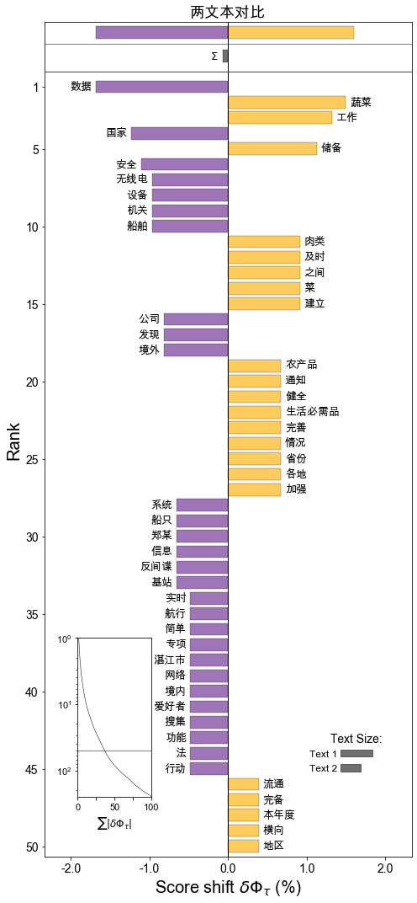

# cntext

中文文本分析库，可对文本进行词频统计、词典扩充、情绪分析、相似度、可读性等

- [github地址](https://github.com/hidadeng/cntext) ``https://github.com/hidadeng/cntext``
- [pypi地址](https://pypi.org/project/cntext/)  ``https://pypi.org/project/cntext/``
- [视频课-**Python网络爬虫与文本数据分析**](https://ke.qq.com/course/482241?tuin=163164df)


功能模块含

- **cntext** 
- **stats**  文本统计,可读性等
- **dictionary** 构建词表(典)
- **sentiment**  情感分析
- **similarity**   文本相似度
- **visualization** 可视化，如词云图


<br>

## 安装

```
pip install cntext==0.9
```


<br>

## 一、cntext

查看cntext基本信息

```python
import cntext

help(cntext)
```

Run

```
Help on package cntext:

NAME
    cntext

PACKAGE CONTENTS
    description (package)
    dictionary (package)
    sentiment (package)
    similarity (package)
    visualization (package)

DATA
    ADV_words = ['都', '全', '单', '共', '光', '尽', '净', '仅', '就', '只', '一共', '...
    CONJ_words = ['乃', '乍', '与', '无', '且', '丕', '为', '共', '其', '况', '厥', '...
    DUTIR_Ais = {'sigh', '一命呜呼', '一场春梦', '一场空', '一头跌在菜刀上－切肤之痛', '一念之差', .....
    DUTIR_Haos = {'1兒巴经', '3x', '8错', 'BUCUO', 'Cool毙', 'NB', ...}
    DUTIR_Jings = {'848', 'FT', '_god', 'yun', '一个骰子掷七点－出乎意料', '一举成名', ......
    DUTIR_Jus = {'一则以喜，一则以惧', '一发千钧', '一年被蛇咬，三年怕草索', '一座皆惊', '一脸横肉', '一蛇两头...
    DUTIR_Les = {':)', 'CC', 'Happy', 'LOL', '_so', 'haha', ...}
    DUTIR_Nus = {'2气斗狠', 'MD', 'TNND', 'gun', 'kao', '一刀两断', ...}
    DUTIR_Wus = {'B4', 'BD', 'BS', 'HC', 'HJ', 'JJWW', ...}
    HOWNET_deny = {'不', '不可', '不是', '不能', '不要', '休', ...}
    HOWNET_extreme = {'万', '万万', '万分', '万般', '不亦乐乎', '不可开交', ...}
    HOWNET_ish = {'一些', '一点', '一点儿', '不丁点儿', '不大', '不怎么', ...}
    HOWNET_more = {'多', '大不了', '如斯', '尤甚', '强', '愈', ...}
    HOWNET_neg = {'一下子爆发', '一下子爆发的一连串', '一不小心', '一个屁', '一仍旧贯', '一偏', ...}
    HOWNET_pos = {'', '一专多能', '一丝不差', '一丝不苟', '一个心眼儿', '一五一十', ...}
    HOWNET_very = {'不为过', '不少', '不胜', '不过', '何啻', '何止', ...}
    STOPWORDS_en = {'a', 'about', 'above', 'across', 'after', 'afterwards'...
    STOPWORDS_zh = {'、', '。', '〈', '〉', '《', '》', ...}

FILE
    /Library/Frameworks/Python.framework/Versions/3.7/lib/python3.7/site-packages/cntext/__init__.py
```

<br>

```python
from cntext import dict_info

dict_info()
```

Run

```
 【大连理工大学情感本体库】
     七大情绪分类，依次是哀、恶、好、惊、惧、乐、怒；对应的情绪词表依次：
    DUTIR_Ais = {"泣血捶膺", "望断白云", "日暮途穷", "身微力薄"...}
    DUTIR_Wus = {"饰非遂过", "恶语", "毁害", "恶籍盈指", "脾气爆躁", "淫贱", "凌乱"...}
    DUTIR_Haos =  {"打破砂锅璺到底", "多彩", "披沙拣金", "见机行事", "精神饱满"...}
    DUTIR_Jings = {"骇人视听", "拍案惊奇", "悬念", "无翼而飞", "原来", "冷门"...}
    DUTIR_Jus ={"山摇地动", "月黑风高", "流血", "老鼠偷猫饭－心惊肉跳", "一发千钧"...}
    DUTIR_Les ={"含哺鼓腹", "欢呼鼓舞", "莺歌蝶舞", "将伯之助", "逸兴横飞", "舒畅"...}
    DUTIR_Nus = {"怨气满腹", "面有愠色", "愤愤", "直眉瞪眼", "负气斗狠", "挑眼"...}
    
    【知网Hownet词典】
    含正负形容词、否定词、副词等词表，对应的词表依次:
    HOWNET_deny = {"不", "不是", "不能", "不可"...}
    HOWNET_extreme = {"百分之百", "倍加", "备至", "不得了"...}
    HOWNET_ish = {"点点滴滴", "多多少少", "怪", "好生", "还", "或多或少"...}
    HOWNET_more = {"大不了", "多", "更", "比较", "更加", "更进一步", "更为", "还", "还要"...}
    HOWNET_neg = {"压坏", "鲁莽的", "被控犯罪", "银根紧", "警惕的", "残缺", "致污物", "柔弱"...}
    HOWNET_pos = {"无误", "感激不尽", "受大众欢迎", "敬礼",  "文雅", "一尘不染", "高精度", "兴盛"...}
    HOWNET_very = {"不为过", "超", "超额", "超外差", "超微结构", "超物质", "出头"...}
    
    【停用词表】
    中英文停用词表，依次
    STOPWORDS_zh = {"经", "得", "则甚", "跟", "好", "具体地说"...}
    STOPWORDS_en = {'a', 'about', 'above', 'across', 'after'...}
    
    【中文副词/连词】
    副词ADV、连词CONJ
    ADV_words = ['都', '全', '单', '共', '光'...}
    CONJ_words = ['乃', '乍', '与', '无', '且'...}
```

<br>

查看词表

```python
from cntext import CONJ_words, ADV_words

#获取连词词表
CONJ_words
```

Run

```
['乃',
 '乍',
 '与',
 '无',
 '且',
 '丕',
 '为',
 '共',
 '其',
 '况',
 '厥',
 '则',
 '那',
 '兼',
 ...
 ]
```


<br><br>

## 二、stats

目前含

- term_freq 词频统计函数，返回Counter类型
- readability 中文可读性

```python
from cntext.stats import term_freq, readability

text = '如何看待一网文作者被黑客大佬盗号改文，因万分惭愧而停更'
term_freq(text)
```

```
Counter({'看待': 1,
         '网文': 1,
         '作者': 1,
         '黑客': 1,
         '大佬': 1,
         '盗号': 1,
         '改文因': 1,
         '万分': 1,
         '惭愧': 1,
         '停': 1})
```


<br>

**中文可读性 ** 算法参考自   

> 徐巍,姚振晔,陈冬华.中文年报可读性：衡量与检验[J].会计研究,2021(03):28-44.

- readability1 ---每个分句中的平均字数
- readability2  ---每个句子中副词和连词所占的比例
- readability3  ---参考Fog Index， readability3=(readability1+readability2)×0.5
             

以上三个指标越大，都说明文本的复杂程度越高，可读性越差。

```python
readability(text)
```

```
{'readability1': 27.0,
 'readability2': 0.17647058823529413,
 'readability3': 13.588235294117647}
```


<br><br>

## 三、dictionary

本模块用于构建词表(典),含

- SoPmi 共现法扩充词表(典)
- W2VModels 词向量word2vec扩充词表(典)

### 3.1 SoPmi 共现法

```python
from cntext.dictionary import SoPmi
import os

sopmier = SoPmi(cwd=os.getcwd(),
                input_txt_file='data/sopmi_corpus.txt',  #原始数据，您的语料
                seedword_txt_file='data/sopmi_seed_words.txt', #人工标注的初始种子词
                )   

sopmier.sopmi()
```

Run

```
step 1/4:...seg corpus ...
Loading model cost 0.678 seconds.
Prefix dict has been built successfully.
step 1/4 finished:...cost 60.78995203971863...
step 2/4:...collect cowords ...
step 2/4 finished:...cost 0.6169600486755371...
step 3/4:...compute sopmi ...
step 1/4 finished:...cost 0.26422882080078125...
step 4/4:...save candiwords ...
finished! cost 61.8965539932251
```


<br>

### 3.2 W2VModels 词向量

```python
from cntext.dictionary import W2VModels
import os

#初始化模型
model = W2VModels(cwd=os.getcwd())  #语料数据 w2v_corpus.txt
model.train(input_txt_file='data/w2v_corpus.txt')


#根据种子词，筛选出没类词最相近的前100个词
model.find(seedword_txt_file='data/w2v_seeds/integrity.txt', 
           topn=100)
model.find(seedword_txt_file='data/w2v_seeds/innovation.txt', 
           topn=100)
model.find(seedword_txt_file='data/w2v_seeds/quality.txt', 
           topn=100)
model.find(seedword_txt_file='data/w2v_seeds/respect.txt', 
           topn=100)
model.find(seedword_txt_file='data/w2v_seeds/teamwork.txt', 
           topn=100)
```

Run

```
数据预处理开始.......
预处理结束...........
Word2Vec模型训练开始......
已将模型存入 /Users/Desktop/cntext/test/output/w2v_candi_words/w2v.model 

准备寻找每个seed在语料中所有的相似候选词
初步搜寻到 572 个相似的候选词
计算每个候选词 与 integrity 的相似度， 选出相似度最高的前 100 个候选词
已完成 【integrity 类】 的词语筛选，并保存于 /Users/Desktop/cntext/test/output/w2v_candi_words/integrity.txt， 耗时 46 秒

准备寻找每个seed在语料中所有的相似候选词
初步搜寻到 516 个相似的候选词
计算每个候选词 与 innovation 的相似度， 选出相似度最高的前 100 个候选词
已完成 【innovation 类】 的词语筛选，并保存于 /Users/Desktop/cntext/test/output/w2v_candi_words/innovation.txt， 耗时 46 秒

准备寻找每个seed在语料中所有的相似候选词
初步搜寻到 234 个相似的候选词
计算每个候选词 与 quality 的相似度， 选出相似度最高的前 100 个候选词
已完成 【quality 类】 的词语筛选，并保存于 /Users/Desktop/cntext/test/output/w2v_candi_words/quality.txt， 耗时 46 秒

准备寻找每个seed在语料中所有的相似候选词
初步搜寻到 243 个相似的候选词
计算每个候选词 与 respect 的相似度， 选出相似度最高的前 100 个候选词
已完成 【respect 类】 的词语筛选，并保存于 /Users/Desktop/cntext/test/output/w2v_candi_words/respect.txt， 耗时 46 秒

准备寻找每个seed在语料中所有的相似候选词
初步搜寻到 319 个相似的候选词
计算每个候选词 与 teamwork 的相似度， 选出相似度最高的前 100 个候选词
已完成 【teamwork 类】 的词语筛选，并保存于 /Users/Desktop/cntext/test/output/w2v_candi_words/teamwork.txt， 耗时 46 秒
```

<br><br>


## 四、 sentiment

- senti_by_hownet 使用知网Hownet词典对文本进行**情感**分析
- senti_by_dutir  使用大连理工大学情感本体库dutir对文本进行**情绪**分析
- senti_by_diydict 使用**自定义词典** 对文本进行**情感**分析


### 4.1 senti_by_hownet(text, adj_adv=False)

使用知网Hownet词典进行(中)文本数据的情感分析，统计正、负情感信息出现次数(得分)

- text:  待分析的中文文本数据
- adj_adv:  是否考虑副词（否定词、程度词）对情绪形容词的反转和情感强度修饰作用，默认False。默认False只统计情感形容词出现个数；

```python
from cntext.sentiment import senti_by_hownet

text = '今天股票大涨，心情倍爽，非常开心啊。'

senti_by_dutir(text)
```

Run

```
{'word_num': 12,
 'sentence_num': 2,
 'stopword_num': 4,
 '好_num': 0,
 '乐_num': 1,
 '哀_num': 0,
 '怒_num': 0,
 '惧_num': 0,
 '恶_num': 0,
 '惊_num': 0}
```

<br>

考虑副词（否定词、程度词）对情绪形容词的反转和情感强度修饰作用

```python
senti_by_hownet(text, adj_adv=True)
```

Run

```
{'sentence_num': 1,
 'word_num': 12,
 'stopword_num': 3,
 'pos_score': 13.0,
 'neg_score': 0.0}
```


<br><br>

### 4.2 senti_by_dutir(text)

使用大连理工大学情感本体库对文本进行情绪分析，统计各情绪词语出现次数。

```python
from cntext.sentiment import senti_by_dutir

text = '今天股票大涨，心情倍爽，非常开心啊。'

senti_by_dutir(text)
```

Run

```
{'word_num': 12,
 'sentence_num': 2,
 'stopword_num': 4,
 '好_num': 0,
 '乐_num': 1,
 '哀_num': 0,
 '怒_num': 0,
 '惧_num': 0,
 '恶_num': 0,
 '惊_num': 0}
```

>情绪分析使用的大连理工大学情感本体库，如发表论文，请注意用户许可协议
>
>如果用户使用该资源发表论文或取得科研成果，请在论文中添加诸如“使用了大连理工大学信息检索研究室的情感词汇本体” 字样加以声明。
>
>参考文献中加入引文“徐琳宏,林鸿飞,潘宇,等.情感词汇本体的构造[J]. 情报学报, 2008, 27(2): 180-185.” 
>
>


<br><br>

### 4.3 senti_by_diy(text)

使用diy词典进行情感分析，计算各个情绪词出现次数，未考虑强度副词、否定词对情感的复杂影响，

- text:  待分析中文文本
- sentiwords:  情感词字典；
      {'category1':  'category1 词语列表',
       'category2': 'category2词语列表',
       'category3': 'category3词语列表',
       ...
      }  

```python
sentiwords = {'pos': ['开心', '愉快', '倍爽'],
              'neg': ['难过', '悲伤'],
              'adv': ['倍']}

text = '今天股票大涨，心情倍爽，非常开心啊。'
senti_by_diydict(text, sentiwords)
```

Run

```
{'pos_num': 1,
 'neg_num': 0,
 'adv_num': 1,
 'stopword_num': 4,
 'sentence_num': 2,
 'word_num': 12}
```

<br><br>


### 4.4 注意

**返回结果**:  **num**表示词语出现次数； score是考虑副词、否定词对情感的修饰，结果不是词频，是情感类别的得分。

<br><br>


## 五、similarity

使用cosine、jaccard、miniedit等计算两文本的相似度，算法实现参考自

> Cohen, Lauren, Christopher Malloy, and Quoc Nguyen. Lazy prices. No. w25084. National Bureau of Economic Research, 2018.

<br>

```
from cntext.similarity import similarity_score

text1 = '编程真好玩编程真好玩'
text2 = '游戏真好玩编程真好玩'

similarity_score(text1, text2)
```

Run

```
{'Sim_Cosine': 0.816496580927726,
 'Sim_Jaccard': 0.6666666666666666,
 'Sim_MinEdit': 1,
 'Sim_Simple': 0.9183673469387755}
```

<br><br>


## 六、visualization

文本信息可视化，含wordcloud、wordshiftor

- wordcloud 词云图
- wordshiftor 两文本词移图

### 6.1 wordcloud(text, title, html_path)

-  text:  中文文本字符串数据
- title:  词云图标题
- html_path:  词云图html文件存储路径

```python
from cntext.visualization import wordcloud

text1 = """在信息化时代，各种各样的数据被广泛采集和利用，有些数据看似无关紧要甚至好像是公开的，但同样关乎国家安全。11月1日是《反间谍法》颁布实施七周年。近年来，国家安全机关按照《反间谍法》《数据安全法》有关规定，依法履行数据安全监管职责，在全国范围内开展涉外数据专项执法行动，发现一些境外数据公司长期、大量、实时搜集我境内船舶数据，数据安全领域的“商业间谍”魅影重重。

2020年6月，国家安全机关在反间谍专项行动中发现，有境外数据公司通过网络在境内私下招募“数据贡献员”。广东省湛江市国家安全局据此开展调查，在麻斜军港附近发现有可疑的无线电设备在持续搜集湛江港口舰船数据，并通过互联网实时传往境外。在临近海港的一个居民楼里，国家安全机关工作人员最终锁定了位置。

一套简易的无线电设备是AIS陆基基站，用来接收AIS系统发射的船舶数据。AIS系统是船舶身份自动识别系统，国际海事组织要求300总吨以上船舶必须强制安装。船只在航行过程中，通过AIS系统向其他船只和主管部门发送船只航向、航速、目的港等信息，用于航行避让、交通导航、轨迹回溯等功能。国家安全机关查获的设备虽然看上去简陋，功能却十分强大。

国家安全机关进一步调查发现，这个基站的来历并不简单。2016年，湛江市的无线电爱好者郑某偶然收到一封境外某海事数据公司发来的邀请邮件。

作为资深的无线电爱好者，能免费领取价值几千元的设备还能获取更多的船舶信息，郑某当然心动。而且，这个基站的架设也非常容易，只要简单组装连上家里的网络，自己的任务就算完成。郑某马上浏览了这家公司申请无线电设备的页面，并按对方要求填写了信息。

"""

wordcloud(text=text1, 
          title='词云图测试', 
          html_path='output/词云图测试.html')
```

Run

[**点击查看词云图效果**](output/词云图测试.html)


<br>


### 6.2 wordshiftor(text1, text2, title, top_n, matplotlib_family)

- text1:  文本数据1；字符串
- text2:  文本数据2；字符串
- title:  词移图标题
- top_n:  显示最常用的前n词； 默认值15
- matplotlib_family matplotlib中文字体，默认"Arial Unicode MS"；如绘图字体乱码请，请参考下面提示

```python
text1 = """在信息化时代，各种各样的数据被广泛采集和利用，有些数据看似无关紧要甚至好像是公开的，但同样关乎国家安全。11月1日是《反间谍法》颁布实施七周年。近年来，国家安全机关按照《反间谍法》《数据安全法》有关规定，依法履行数据安全监管职责，在全国范围内开展涉外数据专项执法行动，发现一些境外数据公司长期、大量、实时搜集我境内船舶数据，数据安全领域的“商业间谍”魅影重重。

2020年6月，国家安全机关在反间谍专项行动中发现，有境外数据公司通过网络在境内私下招募“数据贡献员”。广东省湛江市国家安全局据此开展调查，在麻斜军港附近发现有可疑的无线电设备在持续搜集湛江港口舰船数据，并通过互联网实时传往境外。在临近海港的一个居民楼里，国家安全机关工作人员最终锁定了位置。

一套简易的无线电设备是AIS陆基基站，用来接收AIS系统发射的船舶数据。AIS系统是船舶身份自动识别系统，国际海事组织要求300总吨以上船舶必须强制安装。船只在航行过程中，通过AIS系统向其他船只和主管部门发送船只航向、航速、目的港等信息，用于航行避让、交通导航、轨迹回溯等功能。国家安全机关查获的设备虽然看上去简陋，功能却十分强大。

国家安全机关进一步调查发现，这个基站的来历并不简单。2016年，湛江市的无线电爱好者郑某偶然收到一封境外某海事数据公司发来的邀请邮件。

作为资深的无线电爱好者，能免费领取价值几千元的设备还能获取更多的船舶信息，郑某当然心动。而且，这个基站的架设也非常容易，只要简单组装连上家里的网络，自己的任务就算完成。郑某马上浏览了这家公司申请无线电设备的页面，并按对方要求填写了信息。

"""


text2 = """
通知强调，各地商务主管部门要紧紧围绕保供稳价工作目标，压实“菜篮子”市长负责制，细化工作措施；强化横向协作与纵向联动，加强与有关部门的工作协调，形成工作合力；建立完善省际间和本地区联保联供机制，健全有关工作方案，根据形势及时开展跨区域调运；加强市场运行监测，每日跟踪蔬菜、肉类等重点生活必需品供求和价格变化情况，及时预测，及早预警。

通知要求，各地支持鼓励大型农产品流通企业与蔬菜、粮油、畜禽养殖等农产品生产基地建立紧密合作关系，签订长期供销协议；耐储蔬菜要提前采购，锁定货源，做好本地菜与客菜之间，北菜与南菜之间、设施菜与露天菜之间的梯次轮换和衔接供应；健全完备本地肉类储备规模及管理制度；北方省份要按时完成本年度冬春蔬菜储备计划，南方省份要根据自身情况建立完善蔬菜储备；及时投放肉类、蔬菜等生活必需品储备，补充市场供应。
"""

from cntext.visualization import wordshiftor

wordshiftor(text1=text1, 
            text2=text2, 
            title='两文本对比')
```

Run



<br>

**注意**

> 设置参数matplotlib_family，需要先运行下面代码获取本机字体列表
>         from matplotlib.font_manager import FontManager
>         mpl_fonts = set(f.name for f in FontManager().ttflist)
>         print(mpl_fonts)

<br><br>

## 如果

如果您是经管人文社科专业背景，编程小白，面临海量文本数据采集和处理分析艰巨任务，可以参看[《python网络爬虫与文本数据分析》](https://ke.qq.com/course/482241?tuin=163164df)视频课。作为文科生，一样也是从两眼一抹黑开始，这门课程是用五年时间凝缩出来的。自认为讲的很通俗易懂o(*￣︶￣*)o，

- python入门
- 网络爬虫
- 数据读取
- 文本分析入门
- 机器学习与文本分析
- 文本分析在经管研究中的应用

感兴趣的童鞋不妨 戳一下[《python网络爬虫与文本数据分析》](https://ke.qq.com/course/482241?tuin=163164df)进来看看~

[](https://ke.qq.com/course/482241?tuin=163164df)

<br>

## 更多

- [B站:大邓和他的python](https://space.bilibili.com/122592901/channel/detail?cid=66008)

- 公众号：大邓和他的python

- [知乎专栏：数据科学家](https://zhuanlan.zhihu.com/dadeng)


